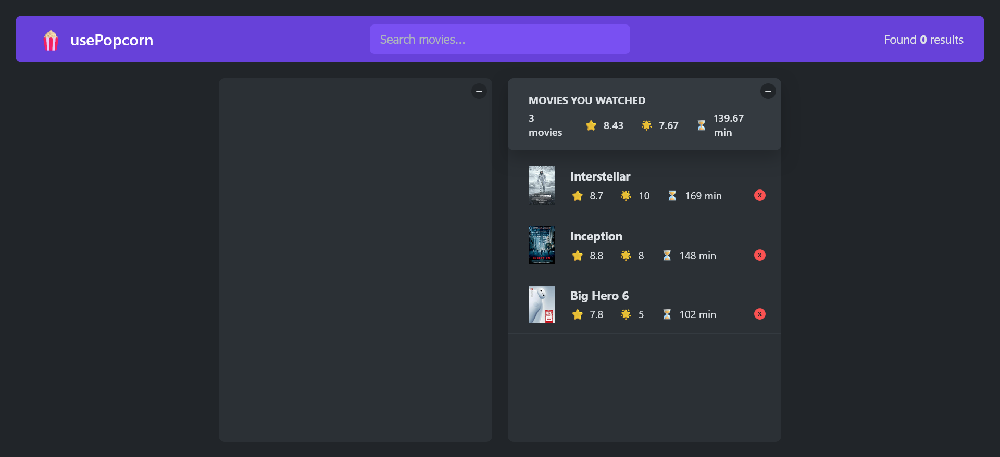

## usePopcorn 🍿

A React-based movie discovery and rating application that allows users to search for movies, view details, and create a personal watchlist with ratings.

## Features

🔍 Search for movies using the OMDB API
📋 View detailed information about selected movies including plot, cast, and IMDb ratings
⭐ Rate movies on a scale of 1-10 using a custom star rating component
📝 Add rated movies to your personal watchlist
📊 Track your viewing statistics including average ratings and runtime
💾 Persistent storage of your watchlist using local storage
📱 Responsive UI with loading states and error handling

## Tech Stack

React 19
Custom React hooks for API fetching and local storage
OMDB API integration
Modern JavaScript ES6+ features

## Project Structure

The project is organized into components and custom hooks:

Components: UI elements like MovieList, MovieDetails, StarRating, etc.
Custom Hooks: useMovies, useLocalStorageState, useKey for reusable logic

## Installation

1. Clone the repository

git clone https://github.com/mahmoud1mandour/usepopcorn.git
cd usepopcorn

2. Install dependencies

npm install

3. Start the development server

npm start

4. Open http://localhost:3000 to view it in your browser

## Usage

Search for movies using the search bar at the top
Click on a movie to view its details
Rate the movie using the star rating component
Add the movie to your watchlist
View your watchlist and statistics in the right panel
API Key
This project uses the OMDB API for fetching movie data. The API key is included in the code for demonstration purposes, but in a production environment, you should:

